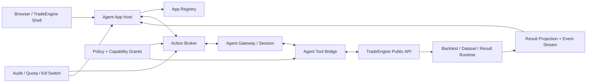

# TradeEngine Agent 可生成应用与个性化主页设计案

## 1. 结论

建议把“Agent 生成网页”实现为新的一级资源 **Agent App**，而不是扩充现有聊天页权限，也不是允许
模型把任意 HTML/JavaScript 写进 TradeEngine 主站。Agent App 负责交互与结果表达；TradeEngine
继续独占身份、资源版本、执行、Result、授权、审计和隔离。应用中的按钮只能发出已声明的 Action，
经 Action Broker 校验后才能调用 Agent 或 Engine。

借鉴“灵光”的是“自然语言生成可编辑、可交互、可分享的小应用”这一产品形态，不复制其未知的
内部实现。公开应用商店介绍把灵光的相关形态描述为“一句话生成可交互可编辑的闪应用，并可发布
分享”；这足以作为交互方向参考，不构成本方案的安全或技术依据。参考：
[小米应用商店的灵光产品介绍](https://r.app.xiaomi.com/details?id=com.antgroup.leopard.android)、
[蚂蚁集团公开介绍](https://weibo.com/xiaoweijinfu?layerid=4776209436903179)。

## 2. 目标与边界

首要目标是让 Agent 能为一个明确任务生成专用页面，例如“策略验收台”“组合风险驾驶舱”“研究
证据工作台”，页面能展示实时进度、Result 图表和表单，并通过按钮继续调用 Agent。用户可以把一份
已经审核发布的 Agent App 设为自己的主页。

以下边界必须保持：

- Agent App 不直接连接数据库、文件系统、Engine 内部对象或第三方网络。
- Agent App 不保存 Engine 登录 Cookie，不持有长期 API Token，不自行判断交易/发布权限。
- 主页替换不覆盖登录、账号、安全设置、权限确认、紧急恢复入口和平台级通知。
- Agent 仍遵守现有的 read / validate / propose / execute 边界；页面不能把 Proposal 伪装成已执行结果。
- 任意一次 Engine mutation 都由现有 Engine API 和验证器作最终裁决，App 版本不是新的执行权威。

## 3. 总体架构



职责划分如下：

| 组件 | 唯一职责 | 明确不负责 |
|---|---|---|
| TradeEngine Shell | 登录、全局导航、安全提示、默认主页、故障回退 | 解释或执行 Agent 生成代码 |
| Agent App Host | 加载已验证 AppVersion、渲染组件、桥接事件 | 直接调用 Engine mutation API |
| App Registry | Draft、不可变 AppVersion、发布状态、签名和依赖锁 | Agent 推理与任务执行 |
| Action Broker | 把 UI Action 变成受约束 Agent invocation，校验输入/权限/幂等 | 策略逻辑和 Engine 语义 |
| Agent Gateway | 对话、计划、工具选择、进度流 | 浏览器 DOM 权限 |
| Tool Bridge | 短期 capability grant、工具参数验证、撤销 | 页面布局 |
| TradeEngine API | 资源、执行、Result、隔离的最终权威 | 信任 App 自报的权限 |

## 4. 一级资源模型

### 4.1 AgentAppDraft

Draft 是可编辑工作区，包含自然语言 Brief、组件树、Action 定义、样式 token、示例数据和验证报告。
它可以由 Agent 修改，但不能被用户设为主页，也不能获得 mutation grant。

### 4.2 AgentAppVersion

发布时封存为不可变版本，身份采用 `appId@sha256:<contentDigest>`。版本必须同时锁定：

- `manifest.json`：路由、组件、Action、数据查询和权限声明；
- `view.json`：平台 DSL 组件树；
- `bindings.json`：组件输入到 Result/DataKey/Agent output 的绑定；
- `assets/`：经过类型、大小和内容策略校验的静态资源；
- validation report：schema、可访问性、依赖、CSP、权限和回归快照；
- provenance：生成它的 Agent、会话、输入 Brief、父版本和发布时间。

建议的最小 manifest：

```json
{
  "schemaVersion": 1,
  "appId": "strategy-acceptance-console",
  "name": "Strategy Acceptance Console",
  "entryRoute": "/",
  "runtime": "trade.agent-app-dsl/v1",
  "components": ["resource-picker", "backtest-form", "task-progress", "result-chart"],
  "queries": ["dataset.read", "resource.read", "backtest.read", "result.read"],
  "actions": {
    "runAcceptance": {
      "inputSchema": {"type": "object"},
      "agentRecipe": "strategy-acceptance-v1",
      "requestedCapabilities": ["backtest.validate", "backtest.submit"]
    }
  },
  "homeEligible": true
}
```

这里的 `requestedCapabilities` 只是申请上限。实际 grant 必须取“用户权限、组织策略、AppVersion 声明、
Action 需要”四者交集，并且短期、单会话、可撤销。

### 4.3 HomeBinding

主页绑定是用户偏好，不复制应用：

```text
userId -> exact AppVersion -> entryRoute -> assignedAt -> assignedBy
```

只有 `published + homeEligible + policyApproved` 的不可变版本可绑定。Shell 在加载失败、版本被撤销、
权限不再满足或连续崩溃时自动回到默认主页。用户始终可从固定的 `Restore default home` 入口解除绑定。

### 4.4 AgentInvocation

每次交互生成不可变调用信封：

```text
invocationId, appVersionId, componentId, actionId, userId,
inputDigest, uiContextDigest, grantId, idempotencyKey, status, outputRefs
```

页面只能读取投影后的状态和 Result 引用；不能把 Agent 的自然语言声称当作 Engine 状态。

## 5. 前端运行模型

第一阶段只支持平台拥有的 JSON DSL 和组件注册表。这能让 Agent 设计新页面，同时复用现有
Dataset、Pipeline、Backtest、Result 和 Visualizer 合同。推荐首批组件不是任意网页标签，而是有
业务语义的 `ResourcePicker`、`BacktestComposer`、`TaskProgress`、`MetricStrip`、`ResultChart`、
`DataTable`、`ProposalReview`、`AgentPrompt` 和 `ApprovalButton`。

第二阶段才允许高级用户发布自定义前端 bundle，而且必须满足：独立 origin；sandboxed iframe；
禁止同源 Cookie；默认无网络；严格 CSP；依赖锁定；Bundle 签名；Host 只通过版本化 `postMessage`
协议暴露查询和 Action。即使 bundle 被攻破，也只能发出 manifest 已声明的消息，不能读取 Shell DOM
或调用任意 URL。

不建议第一版直接采用“Agent 输出 React 项目并部署为主页”。这会同时引入供应链、XSS、Cookie、
路由接管、依赖漂移和不可复现问题，且无法让审计日志回答“这个按钮当时被允许做什么”。

## 6. 一次交互的确定流程

1. 用户在 App 中修改参数并点击一个按钮；组件发出
   `{appVersionId, componentId, actionId, input, idempotencyKey}`。
2. App Host 从登录会话补充 `userId` 和当前 UI context digest，不接受页面自行提交身份或权限。
3. Action Broker 按不可变 manifest 找到 Action，验证 JSON Schema、输入大小、频率和当前资源引用。
4. Broker 计算 capability 交集。只读任务直接签发短期 grant；提交回测、发布资源、替换主页等动作
   使用现有确认门，页面必须显示实际 Engine request 的摘要。
5. Broker 创建 AgentInvocation；Agent 获得 Brief、受限 UI context 和 grant，而不是整站状态。
6. Agent 通过 Tool Bridge 调用公开 API。Engine 再次验证版本、权限、因果合同、幂等键和运行配额。
7. `queued/running/waiting-approval/completed/failed` 事件通过 SSE 或 WebSocket 回到 Host，组件只渲染
   结构化事件。
8. 完成后 Broker 保存 output refs 和审计 digest；页面按 manifest binding 读取 Result projection。

这条链保证“页面能调用 Agent”不等于“页面拥有 Agent 或 Engine 的全部权限”。

## 7. Agent 生成与发布流程

1. 用户向现有 Agent 描述要解决的工作，而不是先选择网页模板。
2. Agent 先产出 App Brief：目标用户、首屏任务、需要读取的资源、可能产生的 mutation 和验收结果。
3. 用户接受 Brief 后，Agent 创建 Draft，组合已注册组件、Action 和 bindings。
4. Builder 对 Draft 执行 schema lint、权限最小化、响应式布局、键盘可达、空/错/慢状态和 mock 数据测试。
5. 用户在隔离 Preview 中操作；Preview 上的 mutation 只能使用模拟响应或显式测试环境 grant。
6. 发布页展示精确 diff：新增/删除组件、读取范围、可执行 Action、Agent recipe、外部依赖和主页资格。
7. 用户确认后 Registry 封存 AppVersion。发布行为本身写审计日志。
8. 用户可选择 `Set as my home`；组织管理员可以允许、禁止或固定某些主页版本。
9. 新版本不会自动替换旧绑定。升级必须明确确认，回滚只是把绑定指回上一不可变版本。

## 8. 数据、状态与连续性

- Server state 只保存资源 ID、Result ID、Invocation ID 和结构化表单值；大对象通过投影 API 分页读取。
- 浏览器本地状态只保存布局偏好、折叠状态和未提交表单草稿，不保存权限 grant 或完整 Result。
- Agent context 采用按 Action 装配的有界数据包，不把整份历史对话或整个 Engine 数据库注入模型。
- 页面和 Agent 的长期记忆分离：AppVersion 描述交互；Agent Project/Session 保存任务记忆；Engine
  Resource/Result 保存事实。三者用不可变 ID 关联，不互相复制成为第二真相源。
- UI 事件、Agent tool call、Engine operation 使用同一 correlation ID，便于从按钮追到最终 Result。

## 9. 安全与故障控制

| 风险 | 强制控制 |
|---|---|
| 生成页面窃取凭证 | App 无 Cookie、无同源 DOM、无任意网络；Host 代发受约束消息 |
| 按钮越权调用 Engine | manifest allowlist + capability 交集 + Engine 二次鉴权 |
| Prompt injection 改写权限 | 权限来自服务端策略，不来自 prompt 或页面文本 |
| 重复点击产生重复任务 | 每个 Action 必须带 idempotency key；Broker 和 Engine 双重去重 |
| 页面假报“已执行” | mutation 状态只能来自 Engine operation/event，不采信 Agent 文本 |
| 生成代码供应链污染 | V1 禁止第三方运行依赖；V2 锁 digest、SBOM、签名和 CSP |
| 个性化主页把用户锁死 | 固定恢复入口、崩溃熔断、管理员 kill switch、默认主页回退 |
| 大查询拖垮 Engine | projection allowlist、分页、行数/字节/频率/并发配额 |
| 版本升级破坏工作流 | 精确 AppVersion 绑定、升级 diff、显式迁移、即时回滚 |

平台应提供三级 kill switch：撤销单次 invocation、停用一个 AppVersion、全局禁用自定义主页。所有级别
都不删除不可变审计证据。

## 10. API 草案

建议在现有认证边界后增加下列应用层 API；它们调用 TradeEngine 公共接口，不侵入 Engine 执行语义：

```text
POST   /api/agent-app-drafts
GET    /api/agent-app-drafts/{draftId}
PATCH  /api/agent-app-drafts/{draftId}
POST   /api/agent-app-drafts/{draftId}/validate
POST   /api/agent-app-drafts/{draftId}/publish
GET    /api/agent-apps/{appId}/versions/{version}
POST   /api/agent-app-invocations
GET    /api/agent-app-invocations/{invocationId}
GET    /api/agent-app-invocations/{invocationId}/events
POST   /api/agent-app-invocations/{invocationId}/cancel
PUT    /api/users/me/home-binding
DELETE /api/users/me/home-binding
```

`publish`、`home-binding` 和 invocation mutation 必须要求 CSRF、同站 Origin、精确版本和审计原因。
事件端点只返回结构化状态、脱敏日志与 Resource/Result 引用。

## 11. 与现有 TradeEngine 的落点

建议新增独立应用层包，而不是把逻辑放进 Engine runtime：

```text
agent_apps/contracts/       Manifest、DSL、Action、Invocation schema
agent_apps/repository/      Draft、AppVersion、HomeBinding
agent_apps/service/         validate、publish、assign、rollback
agent_apps/broker/          grant、idempotency、quota、event relay
agent_web/app_host/         Shell host、组件注册表、Preview
```

现有模块继续原样复用：Agent Gateway 负责 session，Tool Bridge 负责短期 grant，Engine API 负责资源与
执行，Result Projection 负责图表数据，UI sync 只传递有界 context。Engine 内部不解释 Agent App DSL，
也不运行生成 JavaScript。

## 12. 分阶段交付

| 阶段 | 交付 | 退出条件 |
|---|---|---|
| P0 | 冻结合同与威胁模型 | Manifest、Action、Invocation、HomeBinding schema 通过负向测试 |
| P1 | DSL App、Builder Preview、发布/回滚；仍从现有 Agent 页进入 | 只读策略验收台能由 Agent 生成并发布，刷新后完全复现 |
| P2 | Action Broker、进度流、只读与回测提交 Action | 页面按钮可完成一次受审计的 Build/Run/Result 流程，越权请求 fail closed |
| P3 | 用户级个性化主页 | 可设置、升级、回滚、熔断并一键恢复默认主页 |
| P4 | 独立 origin 的签名 bundle | 完成 CSP、供应链、渗透、资源配额和故障注入验收后再开放 |

首个垂直样板建议就是本次 TLM01D02 验收台：固定三套 Dataset 和精确资源版本，页面串行触发 Build、
Run、进度、Result 与三周期图表。它能同时验证资源选择、Agent Action、长任务、Visualizer、审计和
主页绑定，又不会引入真实交易权限。

## 13. 验收标准

- 同一个 AppVersion 在两个干净浏览器会话中渲染出的组件树和 Action manifest digest 完全相同。
- 页面无法直接请求未声明 API；伪造 actionId、resourceId、grant、Origin 或 postMessage source 均失败。
- 只读 Action 不出现 mutation grant；mutation Action 未确认时不会创建 Engine operation。
- 重复点击、网络重试和页面刷新最多创建一个具有同一 idempotency key 的任务。
- 从 UI 按钮到 Agent tool call、Engine operation、Backtest Result 可用一个 correlation ID 完整追踪。
- App 崩溃、版本撤销或权限变化后自动回默认主页，且安全设置与恢复入口始终可达。
- AppVersion 发布后不可原地修改；升级和回滚只改变精确版本绑定。
- TLM01D02 样板能够完成三套 Dataset 的串行回测并复用现有 Result Visualizer，不要求 Agent App
  获得 Engine 内部权限。
